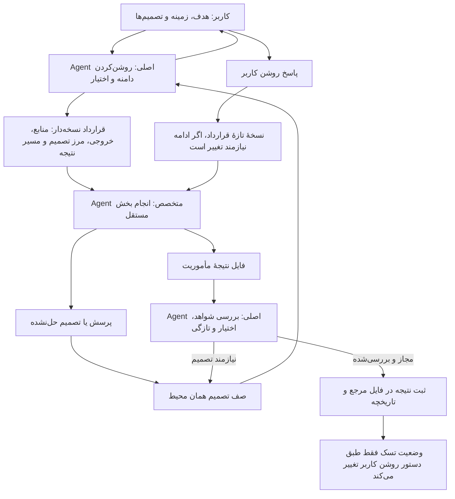
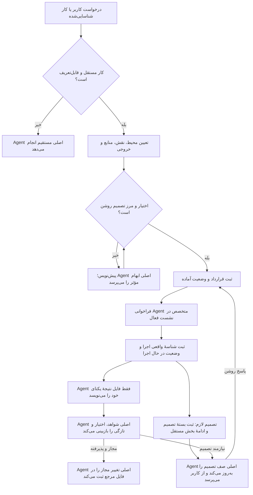
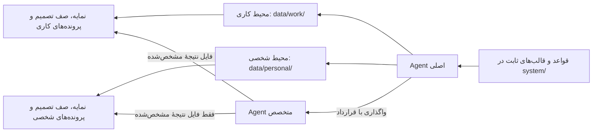

# نمای مصور هماهنگی Agentها

این نمودار نشان می‌دهد Agent اصلی چطور مأموریت را مرزبندی می‌کند، کار مستقل را واگذار می‌کند و تصمیم‌ها را برای کاربر نگه می‌دارد. Agentهای تخصصی موقت‌اند؛ تعریف نقش به معنی اجرای دائمی یا اختیار مستقل نیست.

## جریان مأموریت

## Agent چطور فعال می‌شود؟

نقش‌های جدول بعدی از قبل در پس‌زمینه اجرا نمی‌شوند. Agent اصلی در نشست فعال، برای یک مأموریت مشخص Agent متخصص را فراخوانی می‌کند. کار باید بخش مستقلی با خروجی روشن داشته باشد؛ کار کوچک یا کاری که تصمیم‌هایش هنوز قابل‌تفکیک نیست، مستقیم توسط Agent اصلی انجام می‌شود.

مراحل اجرا:

1. Agent اصلی محیط کاری یا شخصی را تعیین می‌کند، بخش قابل‌واگذاری را از تصمیم‌های نهایی جدا می‌کند و نقش مناسب را انتخاب می‌کند. کاربر لازم نیست نقش فنی Agent را خودش برگزیند.
2. مأموریت در `AGENT-JOBS.md` و قرارداد نسخه‌دار در `AgentJobs/J-###/mission-vN.md` ثبت می‌شوند. قرارداد، هدف و شرط پایان، منابع مجاز، انتخاب‌های مستقل، تصمیم‌های محفوظ، محدودیت‌ها و مسیر یکتای نتیجه را مشخص می‌کند.
3. اگر ابهام مهمی اختیار یا خروجی را عوض کند، قرارداد در «پیش‌نویس» می‌ماند تا Agent اصلی آن مورد را از کاربر بپرسد. پاسخ روشن قبلی دوباره پرسیده نمی‌شود. با روشن‌شدن حدود و وجود مجوز مأموریت، وضعیت «آماده» می‌شود.
4. Agent اصلی Agent متخصص را از ابزار هماهنگی همان نشست فراخوانی می‌کند. فقط پس از شروع موفق، شناسهٔ واقعی اجرا ثبت و وضعیت «در حال اجرا» می‌شود. اجرای موازی فقط برای بخش‌های مستقل با فایل‌های نتیجهٔ جدا مجاز است.
5. Agent متخصص یافته‌ها را در `AgentJobs/J-###/result-vN-attempt-M.md` می‌نویسد. اگر به تصمیمی برسد، پرسش، گزینه‌ها، پیشنهاد، پیامد و بخش متوقف‌شده را می‌آورد و کار مستقل را ادامه می‌دهد. Agent اصلی مورد لازم را در `DECISIONS.md` ثبت و با کاربر نهایی می‌کند.
6. Agent اصلی نتیجه را بررسی می‌کند. نتیجهٔ آماده به‌تنهایی مجوز تغییر تسک نیست؛ ثبت در فایل‌های اصلی فقط در حدود مجوز روشن انجام می‌شود و با رویداد تاریخچه ثبت می‌گردد. تغییر وضعیت تسک به انجام‌شده همچنان نیاز به اعلام روشن کاربر دارد.

| وضعیت مأموریت | معنی |
| --- | --- |
| پیش‌نویس | حدود یا اختیار کامل نیست؛ اجرای بخش وابسته آغاز نمی‌شود |
| آماده | قرارداد و اختیار لازم روشن است؛ هنوز Agent فراخوانی نشده |
| در حال اجرا | ابزار هماهنگی، اجرای واقعی را آغاز کرده است |
| منتظر تصمیم | یک بخش به پاسخ کاربر نیاز دارد؛ بخش‌های مستقل می‌توانند ادامه یابند |
| نتیجه آماده | خروجی رسیده و منتظر بازبینی Agent اصلی است |
| اعمال‌شده | Agent اصلی نتیجهٔ مجاز و بررسی‌شده را ثبت کرده است |
| ناموفق یا لغوشده | شکست یا توقف مأموریت با علت روشن ثبت شده است |

وضعیت مأموریت از وضعیت تسک و تصمیم جداست. اگر نشست پایان یابد، ادامهٔ دائمی تضمین نمی‌شود؛ در نشست بعدی ابتدا وضعیت اجرای قبلی بررسی می‌شود و در صورت نیاز تلاش تازه با مسیر نتیجهٔ تازه ثبت می‌شود. این سازوکار زمان‌بند خودکار یا سرویس Agent همیشه‌فعال نیست.

## نقش‌های تخصصی

| نقش | نمونهٔ کار |
| --- | --- |
| `knowledge-retriever` | بازیابی اطلاعات و دارایی‌ها و مشخص‌کردن منبع، اعتبار و تازگی |
| `document-reviewer` | استخراج ادعاها، شواهد، قوت‌ها، نقص‌ها و پرسش‌های تصمیم‌ساز از سند |
| `work-planner` | پیشنهاد فازها، خروجی‌ها، قدم‌های روزانه و پیش‌نیازها |
| `business-analyst` | تحلیل گزینه‌های مشتری، خدمات، درآمد، قیمت‌گذاری و محاسبات با ذکر فرض‌ها |
| `consistency-reviewer` | پیدا کردن تکرار، تعارض، ارجاع خراب، وابستگی حلقوی و دادهٔ منسوخ |
| `daily-reviewer` | پیشنهاد کار امروز با توجه به موعد، پیش‌نیاز و مسئول اقدام |
| `knowledge-mapper` | پیشنهاد موجودیت‌ها و رابطه‌های مستند برای شبکه و منبع دانش |

## محل نگهداری و حدود اختیار

پرونده و صف تصمیم در هر محیط از محیط دیگر جدا هستند و دادهٔ واقعی آن‌ها محلی می‌ماند. Agent فرعی فقط فایل نتیجهٔ تعیین‌شده را می‌نویسد. Agent اصلی مالک گفت‌وگو، نمایه‌ها، قراردادها، صف تصمیم و فایل‌های مرجع است.

Agent می‌تواند یافته و پیشنهاد آماده کند؛ اما موعد، اولویت، وضعیت، وابستگی یا تصمیم کاری را خودسرانه عوض نمی‌کند. انتخاب‌هایی مثل استخدام، قیمت یا مسیر پروژه و نیز پیام‌دادن، انتشار، تعهد مالی و زمان‌بندی بیرونی باید در قرارداد مجاز شده باشند یا برای تصمیم به کاربر برگردند. آماده‌شدن نتیجه به‌تنهایی به معنی تکمیل تسک نیست.

## پیوندها

- [قواعد کامل واگذاری و اختیار](DELEGATION.ReadOnly.md)
- [شرح نقش‌های تخصصی](AGENT-ROLES.ReadOnly.md)
- [قالب قرارداد مأموریت](AGENT-MISSION-TEMPLATE.ReadOnly.md)
- [صفحهٔ مأموریت‌ها و تصمیم‌ها](../app/agents.html)

