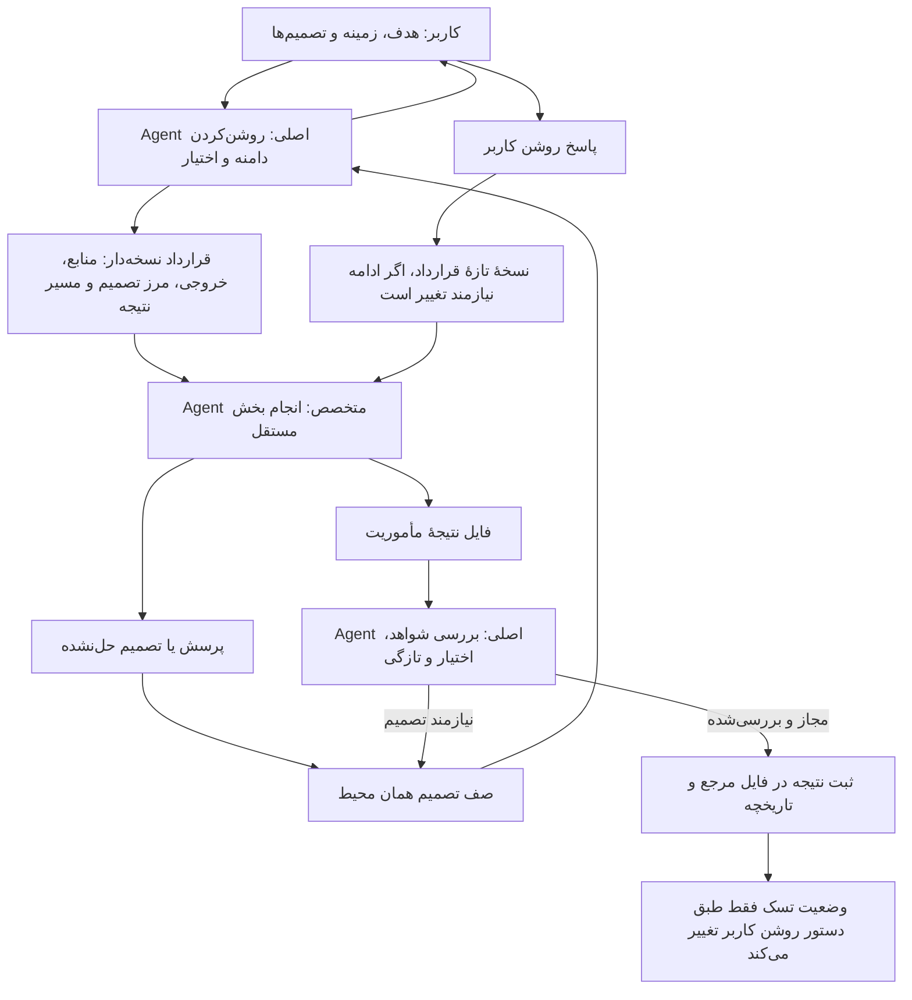
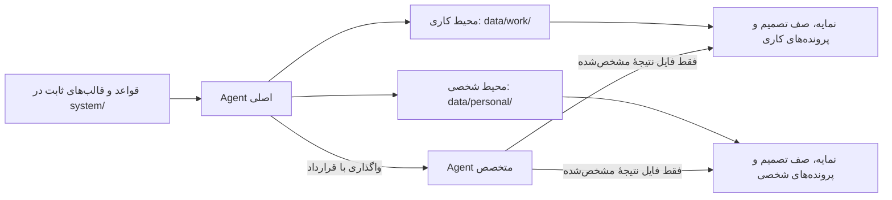

# نمای مصور هماهنگی Agentها

این نمودار نشان می‌دهد Agent اصلی چطور مأموریت را مرزبندی می‌کند، کار مستقل را واگذار می‌کند و تصمیم‌ها را برای کاربر نگه می‌دارد. Agentهای تخصصی موقت‌اند؛ تعریف نقش به معنی اجرای دائمی یا اختیار مستقل نیست.

## جریان مأموریت

## نقش‌های تخصصی

| نقش | نمونهٔ کار |
| --- | --- |
| `knowledge-retriever` | بازیابی اطلاعات و دارایی‌ها و مشخص‌کردن منبع، اعتبار و تازگی |
| `document-reviewer` | استخراج ادعاها، شواهد، قوت‌ها، نقص‌ها و پرسش‌های تصمیم‌ساز از سند |
| `work-planner` | پیشنهاد فازها، خروجی‌ها، قدم‌های روزانه و پیش‌نیازها |
| `business-analyst` | تحلیل گزینه‌های مشتری، خدمات، درآمد، قیمت‌گذاری و محاسبات با ذکر فرض‌ها |
| `consistency-reviewer` | پیدا کردن تکرار، تعارض، ارجاع خراب، وابستگی حلقوی و دادهٔ منسوخ |
| `daily-reviewer` | پیشنهاد کار امروز با توجه به موعد، پیش‌نیاز و مسئول اقدام |
| `knowledge-mapper` | پیشنهاد موجودیت‌ها و رابطه‌های مستند برای شبکه و منبع دانش |

## محل نگهداری و حدود اختیار

پرونده و صف تصمیم در هر محیط از محیط دیگر جدا هستند و دادهٔ واقعی آن‌ها محلی می‌ماند. Agent فرعی فقط فایل نتیجهٔ تعیین‌شده را می‌نویسد. Agent اصلی مالک گفت‌وگو، نمایه‌ها، قراردادها، صف تصمیم و فایل‌های مرجع است.

Agent می‌تواند یافته و پیشنهاد آماده کند؛ اما موعد، اولویت، وضعیت، وابستگی یا تصمیم کاری را خودسرانه عوض نمی‌کند. انتخاب‌هایی مثل استخدام، قیمت یا مسیر پروژه و نیز پیام‌دادن، انتشار، تعهد مالی و زمان‌بندی بیرونی باید در قرارداد مجاز شده باشند یا برای تصمیم به کاربر برگردند. آماده‌شدن نتیجه به‌تنهایی به معنی تکمیل تسک نیست.

## پیوندها

- [قواعد کامل واگذاری و اختیار](DELEGATION.ReadOnly.md)
- [شرح نقش‌های تخصصی](AGENT-ROLES.ReadOnly.md)
- [قالب قرارداد مأموریت](AGENT-MISSION-TEMPLATE.ReadOnly.md)
- [صفحهٔ مأموریت‌ها و تصمیم‌ها](../app/agents.html)
